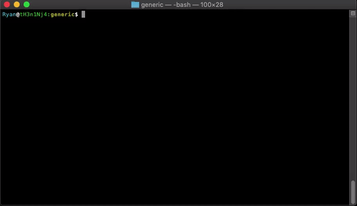

# Parsers
## Purpose
This file serves as documentation for the descriptive specification language using YAML. This language was created in order to facilitate and automate the process of building parsers and testing them against the specification found for each of them on Swaggerhub. All source files for this language currently exist under `tcl3parsers/tests/generic`. While the location of this folder can be moved, the parser relies on a folder immediately under `tcl3parsers/tests` to contain all of the flight files. Currently, this folder is named *flight_files*, but can be changed using the YAML specification as shown below. In addition to this, some of the parsers require using files under `tcl3parsers/external_data`. All paths are configured relatively, so as long as these folders stay in the same relative hierarchy, they can be moved anywhere.

## Dependencies
 - Python 3.4 or greater

## Running the generic parser


In order to run the generic parser, navigate to the `tcl3parsers/tests/generic` directory on the command line and execute `python runner.py`. This will run all parsers configured to run in the *config.yaml* file in the same directory. Running this file will generate a JSON file for each flight folder configured for that parser under the *flight_files* folder. These JSON files will be outputted to the directory specified in the config.yaml. Testing is run concurrently with the generation of the output files, so if data outputted for one flight does not match the specification, then the entire parser will halt and the appropriate error message will be displayed.

### Command Line Interface
The other way to run the parser is by using the Command Line Interface. To run this, navigate to the same directory as `runner.py`. Instead of running this however, run `./flightParser` to run the spec. The flightParser interface has several command line options. First off, instead of having to specify which parser or parsers to run in the `config.yaml` file, these can be run by using the `-p/--parsers` option like below:
```sh
$ ./flightParser -p cns1 cns2 CON2,4_ardu
```

There are also command line options to change the data directory, the inner data folder, and the output directory. A built in `--help` function exists to describe these options.
```
$ ./flightParser --help
usage: flightParser [-h] [-p [PARSERS [PARSERS ...]]] [-d DATADIRECTORY]
                    [-f FLIGHTDATADIRECTORY] [-o OUTPUT]

Command line utility to run parsers specified in the config.yaml file.

optional arguments:
  -h, --help            show this help message and exit
  -p [PARSERS [PARSERS ...]], --parsers [PARSERS [PARSERS ...]]
                        Specify the parsers to run (run)
  -d DATADIRECTORY, --dataDirectory DATADIRECTORY
                        Specify the data directory holding all flight data
                        (parent_data_directory)
  -f FLIGHTDATADIRECTORY, --flightDataDirectory FLIGHTDATADIRECTORY
                        Specify the flight data folder inside of the data
                        directory for each project (flight_data_directory)
  -o OUTPUT, --output OUTPUT
                        Specify the output directory for all data
                        (output_directory)
```

## Logging output
The generic parser is meant to be used as a command line tool. This means all testing errors or misconstrued data will be logged to the command line. In addition to this, all exception cases (mentioned in depth below) that are matched will be logged for each flight. To prevent a large amount of repetitive output, these exception match messages will be collapsed and a message containing the count of exception matches that occurred and the values that the exceptions matched with will be outputted. To log to a file instead of the command line, run the following:
```sh
python runner.py &> output.txt
```

## Configuration - `config.yaml`
All configuration for the generic parser is done under the config.yaml file in the `tcl3parsers/tests/generic` directory. Using this file the following can be configured:
- run
    - Which parsers to run, if no parser is listed, then all parsers will run
- parsers
    - Individual configuration for each parser (more on this below)
- sub_parsers
    - Individual configuration for parsers that run at the same time, with the same files, and output to the same directory as a parent parser
- output_directory
    - Output directory
- cache_specifications
    - Whether or not to cache SwaggerHub specifications
- specification_cache_directory
    - The directory location for the cached SwaggerHub specifications
- parent_data_directory
    - The directory containing data for all parsers
- flight_data_directory
    - The subdirectory containing all flight data for a single parser

### Configuring a parser
New parsers are added under the *parsers* section of the config file. The parser name must correspond to a folder name under the specified `parent_data_directory`.

For example, if the `parent_data_directory` is named *flight_files* and a parser is to be named *cns1*, then the *flight_files* directory should look like this:
```
.
├── flight_files
└──   └── cns1
```
and the configuration for the parser should now start with this:
```yaml
parsers:
    cns1:
```

In addition to this, the parser name is used to find the correct specification in the SwaggerHub file. By default, if the parser's name ends in a number, like in the case of cns1, then the name *CNS1_MOP* is looked for. If the parser's name doesn't end in a number, like in the case of *flight_data*, then an uppercase version of the name is searched for (ex. *FLIGHT_DATA*). To override this name search, a different specification name can be added by using the key `name_override`. If the specified name is not found in the SwaggerHub file, it will immediately fail.

Example override:
```yaml
parsers:
    cns1:
        name_override: NEW_NAME_TO_SEARCH_FOR
```

The next important thing to configure under a parser is the SwaggerHub specification. This can be specified by just passing its URL to the `swagger_hub_spec` key and it will be automatically scraped from the internet. This is where the `cache_specifications` option comes into play now; it is relatively expensive to have to download the specification file and convert it to a format that can be used by the parser, so by caching it, a copy of the specification converted to a format for internal use will be saved in the `specification_cache_directory`. The configuration for the parser should now look like:
```yaml
parsers:
    cns1:
        swagger_hub_spec: https://app.swaggerhub.com/apis/utm/tcl3-cns/v2
```

At this point, a parser is configured that knows where the flight files are and what specification it is testing against. However, if it is run, nothing will be displayed and no file will be outputted. This is for two reasons. First, in order to run the parser, the `run` option at the top of the file must either be empty, or it must be a list containing the parser name like this:
```yaml
run:
    - cns1
```
The next reason nothing is being outputted is because no required files are specified. In order specify a required file, a shortname is needed to label the file, and then a list of conditions that the file's name will be matched to need to be specified. These conditions can either be a regular expression or just part of the file name. For example, the configuration for cns2:
```yaml
cns2:
    swagger_hub_spec: https://app.swaggerhub.com/apis/utm/tcl3-cns/v2
    required_files:
        MI_FILE:
            - mission_insight.csv
            - ^CNS2_.+Flight.+\.csv
        DF_FILE:
            - .log
        RADAR_FILE:
            - Radar Flight
```
In this example, three files are specified as required with the shortnames *MI_FILE*, *DF_FILE*, and *RADAR_FILE*. The parser will iterate through the `flight_data_directory` directory under the *`parent_data_directory`/cns2* and first look for a file either called or containing `mission_insight.csv`. If this isn't found, then it will try to match the regular expression
```js
/^CNS2_.+Flight.+\.csv/
```
If a file matching either of these is found, then it will be aliased to the *MI_FILE* shortname. However, if it is not found for a flight, then the parser will stop and display the following error:
```js
Data malformed, MI_FILE not found for Flight {NUMBER}
in {USER_PATH}/tests/flight_files/con1/data/Flight {NUMBER}
```

Once all of the required files have been specified and are in a location that the parser can find them, then the next step is to actually parse the files. For this reason, there are three classes of mini-parsers:
- global_parsers
- file_parsers
- variable_parsers

The names of these parser types correspond to folders under *parsers/parser_pieces*, which exists in the same directory as the *config.yaml* file. Each of these parser types has its advantages and disadvantages.

#### global_parsers
Global parsers are the least efficient type of parser and should be used sparingly. This is because parsing is done using a model system. The main, generic parser starts with a model of what the the JSON file should look like. This model contains all top-level variables with default values that are empty for their type that it gets from the SwaggerHub specification (so if a top-level variable was supposed to be an int, then the default value would be `0`). Parsers are then called to fill in this data and replace default values. The purpose of a global parser is to be able to add or change any variable and use any file in the current flight directory. In order to do this, every global parser needs to have the entire model passed to it and an dictionary containing the absolute paths to all required files (with their shortname as the key). Then, the global parser is expected to return the entire model. In order to make these as efficient as possible, global parsers are executed first before any other type of parser, but if there are multiple global parsers dealing with a lot of data, this can cause a major performance hit.

An example configuration of a global parser (note the lack of *.py* for the parser file name):
```yaml
sub_parsers:
    flight_data:
        swagger_hub_spec: https://app.swaggerhub.com/apis/utm/tcl3-flight-data/v3
        required_files:
            MI_FILE:
                - mission_insight.csv
                - ^[A-Z]{3,3}[1-9]_.+Flight.+\.csv
            DF_FILE:
                - .log
        global_parsers:
            - flight_data_df
```

Example *flight_data_df.py*:
```py
import csv

def flight_data_df(model, files):
    with open(files["MI_FILE"], "r") as mi_file:
        mi_reader = csv.DictReader(mi_file)
        for row in mi_reader:
            mi_dict = row
    .
    .
    .

    return model
```
If the model is not returned, then the execution of the generic parser will stop and an appropriate error will be displayed.

#### file_parsers
File parsers are similar to global parsers in that they are passed the whole model and are expected to return it. However, instead of being passed all of the files, they are only passed one file. This makes them slightly less powerful than global_parsers, but are still subject to the same inefficiencies.

Example configuration of a file parser:
```yaml
parsers:
    cns1:
        swagger_hub_spec: https://app.swaggerhub.com/apis/utm/tcl3-cns/v2
        required_files:
            MI_FILE:
                - mission_insight.csv
            DF_FILE:
                - .log
            FIELD_VARS:
                - field_vars.csv
        file_parsers:
            MI_FILE:
                parser: mission_insight
            DF_FILE:
                parser: data_flash
            FIELD_VARS:
                parser: field_vars
```

Example *mission_insight.py*:
```py
import csv

def mission_insight(model, fileName):
    with open(fileName, "r") as mission_insight_file:
        mi_reader = csv.DictReader(mission_insight_file)
        mi_dict = next(mi_reader)

        time = mi_dict["SUBMIT_TIME"]
        date = mi_dict["DATE"]

        basic = {}
        basic["uvin"] = mi_dict["UVIN"]
        basic["gufi"] = mi_dict["OPERATION_GUFI"]
        basic["submitTime"] = date + "T" + time
        basic["ussInstanceID"] = mi_dict["USS_INSTANCE_ID"]
        basic["ussName"] = mi_dict["USS_NAME"]

        model["basic"] = basic

    return model
```
Note in this case that fileName is a string. For cases like the above where only one variable (*basic*) is affected however, it would actually be much more efficient to use a variable parser.

#### variable_parsers
Variable parsers are by far the most efficient type of parser and if speed is of concern, then they should be used whenever possible. Variable parsers are also the most unique type of parser. A mini-parser file for the variable can be specified, the variable itself can be specified if it is a fixed value, or an exception value for the variable can be matched and subsequently fixed.

To declare a variable parser, first specify the variable_parsers key, then specify the variable name as a child key. If the variable name is nested under another parent variable or variables, then specify the top level variable followed by the nested variables in brackets. For example, the configuration file for cns1:
```yaml
parsers:
    cns1:
        swagger_hub_spec: https://app.swaggerhub.com/apis/utm/tcl3-cns/v2
        required_files:
            MI_FILE:
                - mission_insight.csv
            DF_FILE:
                - .log
            FIELD_VARS:
                - field_vars.csv
        variable_parsers:
            fType:
                exact: CNS1
            UTM-TCL3-DMP-RevF-CNSPDF:
                exact: UTM-ACUASI-CNS-1.pdf
            plannedContingency[plannedContingencyLoiterAlt_ft]:
                exact: '[0]'
            plannedContingency[plannedContingencyLoiterRadius_ft]:
                exact: '[0]'

```

##### Exact variable parsers
In the above example, 4 variable parsers are specified. *fType* and *UTM-TCL3-DMP-RevF-CNSPDF* are top level variables that are set to the strings *CNS1* and *UTM-ACUASI-CNS-1.pdf*, respectively. However, *plannedContingencyLoiterAlt_ft* and *plannedContingencyLoiterRadius_ft* are variables that exist under the top level variable *plannedContingency*. Furthermore, if you notice, these variables are set to exact matches in quotes. This is because YAML would interpret `[0]` as an array with the value `0` if it was left unquoted, but the specification requires a stringified version of an array, so quotes are used to explicitly set this.

##### Python file variable parsers
Besides *exact* variable parsers, python mini-parser files can also be used to get the value of a variable. These mini-parser files should be created under *parsers/parser_pieces/variable_parsers*. The naming convention of the files is completely arbitrary, but inside of the python file should be a function that has the exact same name as the file. This will be used as the entry function. The entry function of a variable parser file is sent one parameter. This parameter is a dictionary containing keys that correspond to the `required_files` shortnames and have a value that is the absolute path of the file. Furthermore, this entry function is expected to return the value of the variable they are called for. For this reason, a good name for a variable parser to make things less confusing is the exact name of the variable they are used to parse.

An example configuration using a variable parser to get the variable *uasTruth* (note the exclusion of the *.py* when specifying the parser name):
```yaml
cns2:
    swagger_hub_spec: https://app.swaggerhub.com/apis/utm/tcl3-cns/v2
    required_files:
        MI_FILE:
            - mission_insight.csv
            - ^CNS2_.+Flight.+\.csv
        DF_FILE:
            - .log
        RADAR_FILE:
            - Radar Flight
    variable_parsers:
        uasTruth:
            parser: uasTruth
```

An example of the *uasTruth.py* file:
```py
import csv

def uasTruth(files):
    radar_file_name = files['RADAR_FILE']
    uasTruthVariable = []
    with open(radar_file_name, "r") as radarFile:
        radarRecords = csv.DictReader(radarFile)
        for radarRecord in radarRecords:
            uasTruthVariable.append(formRadarRecord(radarRecord))

    return uasTruthVariable
...
```

In the above example, notice that it is a regular python file. Libraries can be imported and other functions can (and should) be declared to make things more readable. For example, the function formRadarRecord is used above. This function exists elsewhere in the actual *uasTruth.py* and is used to handle most of the work of forming the record. Also note that to get the radar file's location, the shortname for it in the config.yaml file is used as a key. At the end of the function, the formed variable is then returned.

##### Exception variable parsers
Exception variable parsers are often used in conjunction with either a Python file variable parsers or another type of parser mentioned below. This type of parser is primarily used for adding allowances to the test cases. For example, if the specification from SwaggerHub stated that a certain variable must be a list of ints with a minimum size of 1 and no data exists for this variable, then an exception can be added to allow the case that the variable is null (or None, as would be used in the config file and Python). An example of this can be seen here:
```yaml
cns2:
    swagger_hub_spec: https://app.swaggerhub.com/apis/utm/tcl3-cns/v2
    required_files:
        MI_FILE:
            - mission_insight.csv
            - ^CNS2_.+Flight.+\.csv
        DF_FILE:
            - .log
        RADAR_FILE:
            - Radar Flight
    variable_parsers:
        uasTruth[estimatedTruthPositionError95Prct_in]:
            exception: None
```
If there are multiple exceptions that you want to allow, such as say in the case that the specification requires an int in a specific range, but there are three anomalies that you want to allow, then multiple exceptions can be specified like this:
```yaml
uasTruth[estimatedTruthPositionError95Prct_in]:
    exception: [0, 1, 2]
```
As you'll notice in the above example, the three cases that were matched were exact values, rather than a type such as *None*. This is because exceptions can match either type names or exact values. If you wanted to get complex and add an exception specifically for an array containing the values `0`, `1`, and `2`, then it can just be nested inside of another array like this:
```yaml
uasTruth[estimatedTruthPositionError95Prct_in]:
    exception: [[0, 1, 2]]
```

###### Fixing exceptions
Besides using exceptions for allowing anomalous data, exceptions can also be used to select certain values that a variable may contain and 'fix' them to be another, normalized value. For example, if you wanted to change all matches of *None*, *int*, and the empty string '' to 0, then the following exception-fix case could be used:
```yaml
uasTruth[estimatedTruthPositionError95Prct_in]:
    exception: [None, int, '']
    fix: 0
```
Since the value of the fix is evaluated in Python, the fix could be more complicated and be the *None* type or a data structure such as an array. One thing to note with the fix keyword though, for the exception to be matched, the testing cases have to run, which only occurs after the parser has output the file. This means that in order for the fix keyword to change the value, then the file has to be rewritten. For small to reasonably big files this isn't a problem, but for large files, this could be slow and the exceptions should probably be fixed using a mini-parser.

#### Sub parsers
A sub parser operates exactly the same as a regular parser and follows all of the rules as defined above, including having their own SwaggerHub specification. However, sub parsers differ in that they are not standalone parsers and are instead meant to be run under a parent parser. A sub parser will have access to the same files as the parent parser, will output to the same folder as the parent parser, and will always execute immediately after their parent parser finishes.

An example of a sub parser is the flight_data parser:
```yaml
parsers:
    cns1:
        swagger_hub_spec: https://app.swaggerhub.com/apis/utm/tcl3-cns/v2
        sub_parsers:
            - flight_data
        required_files:
            MI_FILE:
                - mission_insight.csv
            DF_FILE:
                - .log
        ...

sub_parsers:
    flight_data:
        swagger_hub_spec: https://app.swaggerhub.com/apis/utm/tcl3-flight-data/v3
        required_files:
            MI_FILE:
                - mission_insight.csv
                - ^[A-Z]{3,3}[1-9]_.+Flight.+\.csv
            DF_FILE:
                - .log
        global_parsers:
            - flight_data_df
        ...
```
Notice that all the parent parser needs to do to include the sub parser is have a key called `sub_parsers` that has values corresponding to the arbitrary name of the sub parsers under the top level `sub_parsers` key. An arbitrary number of sub parsers can be included in a list. However, sometimes a sub parser should only be run for certain folders that the parent parser iterates over. In these cases, the `for` keyword can be used to specify what the directory hierarchy must contain in order for it to run.

An example using the `for` keyword:
```yaml
parsers:
    CON2,4_dji:
        sub_parsers:
            - con4
            - con2_dji:
                for: [
                    2018-05-25/N252MH/Flight 2,
                    2018-05-25/N252MH/Flight 5
                ]
            - dji_flight_data
sub_parsers:
    con4:
        ...
    con2_dji:
        ...
    dji_flight_data:
        ...
```

Another feature that comes in handy when dealing with sub parsers is the `skip_if_files_not_found` keyword. As the name suggests, if this is under a parser or a sub parser and set to true, then if one of the required files needed for proper execution of the parser is not found, then it will be skipped.

An example using the `skip_if_files_not_found: true` keyword:
```yaml
sub_parsers:
    flight_data:
        swagger_hub_spec: https://app.swaggerhub.com/apis/utm/tcl3-flight-data/v3
        skip_if_files_not_found: true
        required_files:
            MI_FILE:
                - mission_insight.csv
                - ^[A-Z]{3,3}[1-9]_.+Flight.+\.csv
                - ^[A-Z]{3,3}[1-9].+\.csv
            DF_FILE:
                - .log
        global_parsers:
            - flight_data_ardu
        file_parsers:
            MI_FILE:
                parser: mission_insight
        ...
```
